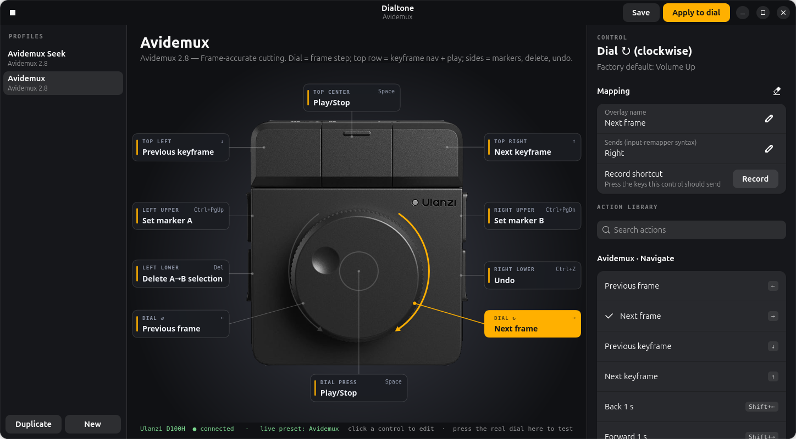

# Dialtone



Per-app mapping profiles for the **Ulanzi D100H** dial on Ubuntu, without Ulanzi Studio.
Dialtone keeps human-readable JSON profiles and compiles them into
[input-remapper](https://github.com/sezanzeb/input-remapper) 2.x presets, which do the
actual grabbing and injection.

```
profiles/*.json  ──►  dialtone  ──►  ~/.config/input-remapper-2/presets/Ulanzi Dial/*.json  ──►  input-remapper daemon
```

## Why this works on Linux
Offline, the D100H emits fixed HID codes (volume, media keys, Ctrl+C/V/Z/Y). Windows hides
the keyboard-page keys from apps; Linux doesn't: input-remapper grabs the evdev node, so
all 7 keys and the dial are remappable. See [docs/hardware.md](docs/hardware.md).

## Quick start
```bash
sudo apt install input-remapper python3-gi gir1.2-gtk-4.0 gir1.2-adw-1   # GTK >= 4.14, libadwaita >= 1.4
python3 -m dialtone list
python3 -m dialtone apply Avidemux --autoload   # write preset, start it, load at login
python3 -m dialtone gui                         # GTK editor
python3 -m dialtone stop                        # give the dial back its defaults
```

## The editor
- **The dial is the UI.** Photo of the D100H with a callout for each control showing what it does right now.
  Click a key, a callout, or the knob (left half = ↺, right half = ↻, centre = press) to edit it.
- **Action library.** Searchable, grouped actions for the current app (Avidemux built in) plus general
  media, navigation, editing and scroll actions. Click one to assign it.
- **Record shortcut.** Hit *Record*, press the combo, done. Escape cancels.
- **Live test.** With the window focused, pressing the real dial lights up the matching control and
  spins the on-screen knob.
- **Profiles.** Duplicate or create profiles, rename them by clicking the title. Your edits save to
  `~/.config/dialtone/profiles/`; built-ins are never overwritten.
- **Apply to dial** saves, writes the input-remapper preset and makes it live (and the login default).
  ■ releases the dial back to factory volume/media keys.

Launcher for the app grid: `sh data/install-desktop.sh`.

## Profile format
```json
{
  "schema": 1,
  "name": "Avidemux",
  "device": "ulanzi-d100h",
  "controls": {
    "dial_cw":    { "output": "Right",             "label": "Next frame" },
    "left_upper": { "output": "Control_L + Prior", "label": "Set marker A" }
  }
}
```
`output` is anything input-remapper accepts: a key symbol, `a + b` combo, or a macro
(`key(x).wait(50).key(y)`). Control ids live in [devices/ulanzi-d100h.json](devices/ulanzi-d100h.json).
User profiles go in `~/.config/dialtone/profiles/` and override built-ins by name.

## origin_hash without root
input-remapper ties each mapping to a source node by
`md5(str(capabilities) + name)`. Dialtone rebuilds that from world-readable sysfs, so it
can generate presets without root or the `input` group. `python3 -m dialtone hash` shows them.

## Roadmap
- [ ] Auto-switch profile by focused app (GNOME/Wayland needs a Shell extension; X11 can poll)
- [ ] Hold-to-shift layers (input-remapper combos / macros)
- [ ] Optional on-screen dial overlay (assets from ulanzi-d100h-homebrew)
- [ ] .deb / Flatpak packaging
- [ ] More devices (D200, other HID dials) via `devices/*.json`

## Credits
Dial photo layers and key geometry: [brendanwelsh/ulanzi-d100h-homebrew](https://github.com/brendanwelsh/ulanzi-d100h-homebrew)
(MIT, see `dialtone/assets/dial-skin/LICENSE`). HID behaviour from [brendanwelsh/ulanzi-d100h-homebrew](https://github.com/brendanwelsh/ulanzi-d100h-homebrew).
Not affiliated with Ulanzi.
